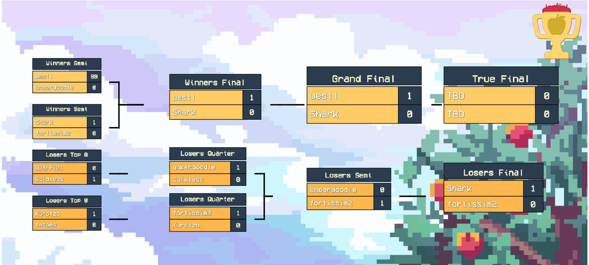
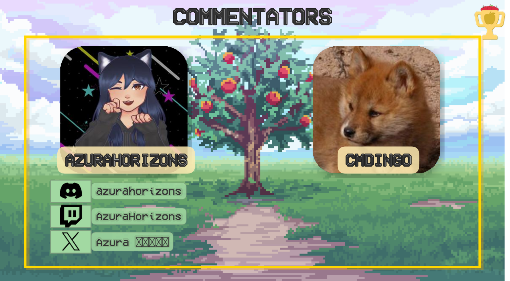

# Tournament Scenes

## Description
This project generates stunning tournament scene visualizations for the prestigious TETR.IO tournament, **Apple Orchard Cup**. Using Python (`matplotlib`, `Pillow`), it includes customizable player cards, brackets, and commentary scenes to enhance the viewing experience.

## Setup

### Install Dependencies
Install the required dependencies:

```bash
pip install -r requirements.txt
```

## Running

### Generate Scenes
- **Bracket Scene**: Generate using `bracket.py`, which creates `scenes/bracket_scene.gif`.
    - Edit `players_data.json` to change the player names and scores.

```bash
python bracket.py
```


- **Versus Screen**: Generate using `versus.py`, which creates `scenes/versus_screen.gif`.
    - Modify the user ID, seed, and flavour text for the two players.

```bash
python versus.py
```


- **Commentary Scene**: Generate using `commentary.py`, which creates `scenes/commentary_scene.png`.
    - Modify the user IDs for the two commentators.

```bash
python commentary.py
```

